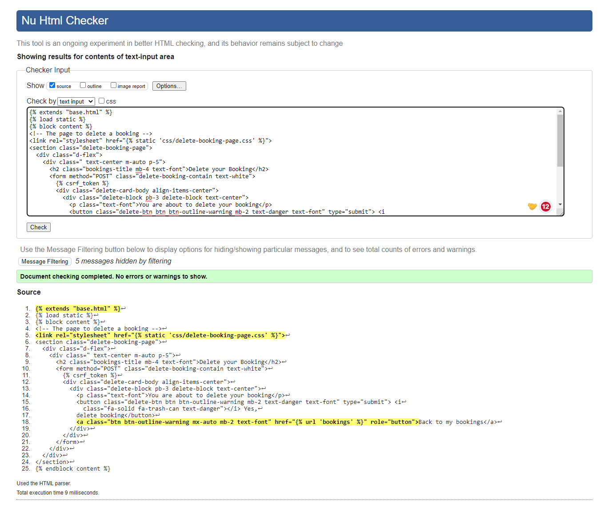
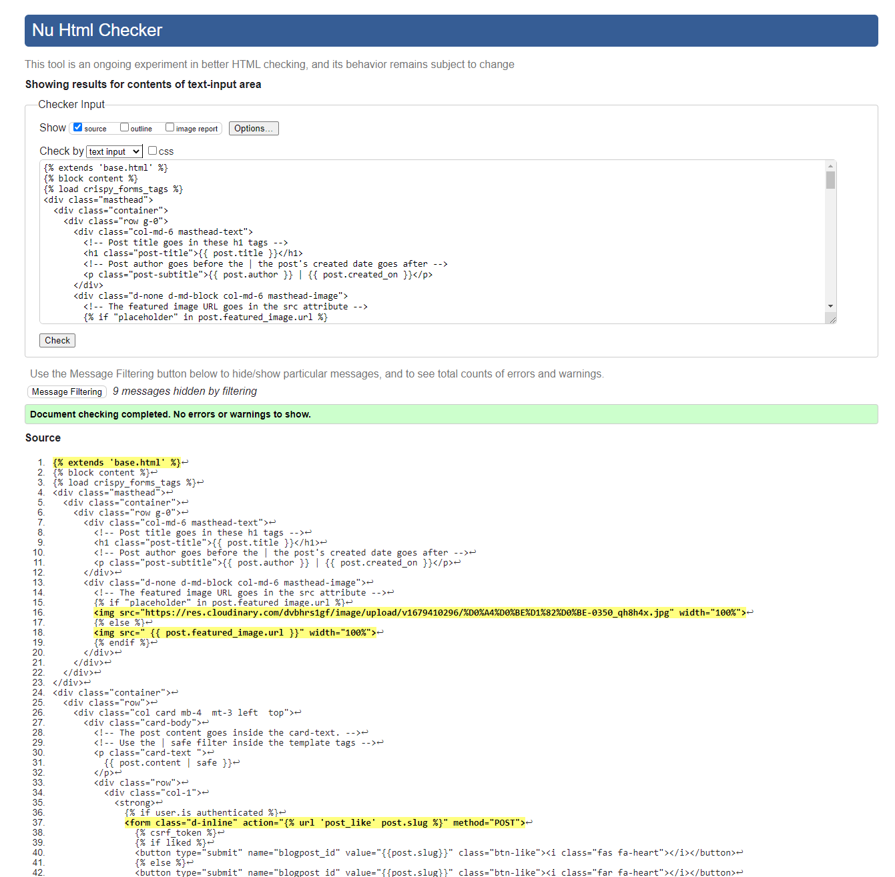

- [**UX (User Experience)**](#ux-user-experience)
  - [**User Stories**](#user-stories)
- [**Design and Site Structure**](#design-structure)
  - [**Functional Structure**](#functional-structure)
  - [**Wireframes**](#wireframes)
- [**Features**](#features)
  - [**Responsive Design**](#responsive-design)
- [**Technologies**](#technologies)
  - [**Languages**](#languages)
  - [**Frameworks and Libraries**](#frameworks)
  - [**Tools**](#tools)
- [**Testing**](#testing)
- [**Deployment**](#deployment)
- [**Credits**](#credits)
  - [**Code**](#code)
  - [**Content**](#content)
  - [**Media**](#media)
  - [**Inspiration**](#inspiration)
  - [**Acknowledgments**](#acknowledgments)

 
# Portfolio Project 4 - Aquarium House

The deployed [AQUARIUM](https://app-portfolio-project-four.herokuapp.com/) app.

The [GitHub repository](https://sergiykoche-portfoliopr-sugfh0sfbwm.ws-eu90.gitpod.io/)

Project goals
This is the fourth project under the Code Institute Diploma in Software Development (E-commerce Applications) program. This website is a fictional aquariumistics called AQUARIUM. It is designed to be responsive and accessible on a variety of devices for the ease of use of the site by potential users.

## UX (User Experience)

### User stories

#### First time visitor goals

As a first time visitor, I want:
* to easily understand the main purpose of the site.
* to be able to easily navigate throughout the site.
* to be able to register a user account to access all content without restrictions.
* to be able to log out of my user account.
       
        
#### Returning and frequent user goals

As a returning user, I want:
* to sign in to my user account.
* to make a service booking.
* to view my booking details. 
* to edit my booking details or delete them.
* to sign out of my account to keep my account safe.
* to be able to reserve a day and time for a service, view booking details and make changes to created bookings and delete my bookings.

#### Site Administrator goals
As a Site Administrator I would like to be able to create, view, edit and delete booking data.    

[Back to the top](#table-of-contents)

### Agile tools

The GitHub Projects section was used as a [Kanban board](https://github.com/users/SergiyKochenko/projects/6) for the development of this project, which made it possible to break down the project execution into subtasks and make it easier to complete and track project progress.
[User stories](https://github.com/SergiyKochenko/portfolio-project-four/issues) were used to break down the project into sub-tasks and placed on the Kanban board to work on them and track progress.

## Design and Site structure

The site was based on the Blog template from the CodeInstitute site. The look of the site, color scheme, font, logo and image for the home page were made by myself from the template.
The main page layout can be seen below:

---
Aquerium House website design templates

About page 

Home page 

Pricing page 

Contact page 

Book Now page 

My Bookings page 

Logout page 

Login page 

Register page 

 

### Functional Structure

**Home page:** The home page contains a menu, logo and an image that gives the user an idea of ​​the type of service provided. Under the logo in the center are links to register a new user or login for an existing user.
Registration and login are also available from the navigation bar.

**Registration page:** The user must create an account to make a reservation. !!!!!!!!!!!!!!!!!!!!!!!!!!!!
To do this, user is asked to fill out a form on the page with the required fields: username and password. There is also an optional email field.

**Login page:** A username and password are required to log in existing users.
The user can use the navigation menu or the link under the logo on the home page.
After a successful login, the user receives a message at the top of the screen and is redirected to the main page. !!!!!!!!!!!!!!!!!!!!!

**Logout page:** Logging out of the account is done through the menu, after which the user is redirected to the logout page where user must confirm his desire to log out of the account. After a successful logout, the user is returned to the main page and receives a message at the top of the screen.

**Booknow page:** The Booknow page is only available to authenticated users.
The user is asked to fill out a form with the required fields - name, service, time and date, and an optional field - phone, email.
After filling out the form, the user is redirected to the page of current bookings.

**Booking page:** Only authenticated users have access to the Booking page. The link to this page becomes visible in the navigation menu once a user is authenticated. Booking page shows to user information about made bookings and contains Change button and Delete button for manage booking.

**Change booking page:** This page is available only to authenticated users and has the same functionality and form as the Booknow page, where users can change  booking details.

**Delete booking page:** This page is only available to authenticated users and has the same functionality and form as the Booknow page, where the user can change the booking details. The user has the ability to delete user's booking by selecting the Delete button on the Booking page. After that, user will be redirected to the delete page where user needs to confirm user's intention. After successfully deleting the booking, user will return to the Booking page and and receives a message at the top of the screen.
Also, if the user changes user's mind, user can return to the page by clicking on the Back to my Bookings button.

[Back to the top](#table-of-contents)

MADE FORMATING HTML WITH: https://www.freeformatter.com/html-formatter.html#before-output

MADE FORMATING CSS WITH: https://www.cleancss.com/css-beautify/

MADE FORMATING PYTHON WITH: https://black.vercel.app/

## Testing

### Bugs

#### Fixed Bugs

|  Bug  |Bug image  |  Solution  |Status   |
|--|--|--|--|
|  
Menu on mobile devices is positioned incorrectly |  | fixed CSS style   | fixed |
|Booking form does not appear on the booking page  |  | fixed by passing form object to the booknow.html template , placing form tags in in the proper template booknow.html | fixed |
| In the Gitpod Environment the site works with full CSS style,  but on Heroku the site  and the admin page (/admin) comes up without CSS styling  | - | Set DEBUG variable to False and remove the DISABLE_COLLECTSTATIC variable | fixed |
| Function get_min_date isn't defined  | | fixed by removing function from views.py file and placing function in the forms.py so the form can access that function | fixed  |
| When an invalid phone number is entered on the Booknow page, the form clears the fields and returns to its original state with no messages to the user. The Change Booking page also returns the form to its original state with pre-filled fields | - | Added regex validation for numeric input and displaying a message to the user | fixed  |
| Pricing elements on the Pricing page are not displayed correctly on mobile devices |  | added media queries rules for small screen devices  | fixed  |

#### Unresolved Bugs
No known bugs remaining

[Back to the top](#table-of-contents)

---
### Manual Testing

#### Device Testing

The Project was tested using a multi-device emulator with different display sizes in the Google Chrome Developer Dashboard.
The following devices have been tested:

- Nest HubMax (Desktop)
- iPad Pro (Tablet)
- iPad Air (Tablet)
- iPad Mini (Tablet)
- Galaxy Tab S4 (Tablet)
- Nexus 7 (Mobile)
- Nokia N9 (Mobile)
- iPhone 12 Pro Max (Mobile)
- iPhone 5/SE (Mobile)
- iPhone 4 (Mobile)

#### Browsers Tested

Testing has been carried out on the  following browsers: 
  - Google Chrome
  - Firefox
  - Microsoft Edge

The site was constantly tested during the process of creating the site in the Gitpod Environment and the deployed site on Heroku was also tested in terms of user experience.
The available functionality and user experience is reflected in the table below.

| Goals/actions  | As a guest | As a logged user  | Result | Comment |
|--|:--:|:--:|:--:|--|
| User can use menu and navigating through pages | &check; | &check; | Pass | Click on menu item redirects to appropriate page |
| User can see the home page | &check; | &check; | Pass | |
| User can see the Pricing page | &check; |&check;  |  Pass| |
| User can see the Sign Up page | &check; |&check;  |  Pass| |
| User can see the Login page  | &check; |&check;  |  Pass| |
| User can see the Logout page  | &check; |&check;  |  Pass| |
| User can click the Book Now button  | &check; |&check;  |  Pass| Redirects to the page with a message that the user must register or log in for guest or shows up form for authorized user |
| User can see the Booknow page | &cross; | &check;  | Pass |A page is displayed with a message that the user must register or log in  |
| User can fill fields in the form the Booknow page | &cross; | &check;  | Pass |This page and form are available only to authorized users |
| User can see the Bookings page   | &cross; | &check;  | Pass | This page is available only to an authorized users|
| User can see the Change booking page  | &cross;  | &check;  | Pass | This page is available only to authorized users|
| User can edit booking in the form on the Change booking page  | &cross;  | &check;  | Pass |This page is available only to authorized users ||
| User can see the Delete booking page  |  &cross; | &check;  |Pass  | This page is available only to authorized users |
| User can see the  User's blog page  |  &check; | &check;  |Pass  |  |
| User can see the Create post  |  &cross; | &check;  |Pass  | This page is available only to authorized users |
| User can see the Delete post  |  &cross; | &check;  |Pass  | This page is available only to authorized users |
| User can see the  Update post  |  &cross; | &check;  |Pass  | This page is available only to authorized users |
| User can see the  attach image  |  &cross; | &check;  |Pass  | This page is available only to authorized users |
| |

 

## Validation

### HTML Validation:

The [W3C Markup Validation Service](https://validator.w3.org/) was used to validate the HTML of the website. 
There were errors and warnings in the reports about unclosed elements and tags, incorrect values ​​and types of elements, unnecessary trailing slashes. All errors and warnings have been fixed, the project's HTML code has been re-checked without errors.

base.html

about.html

bookings.html

booknow.html

change-booking.html

contact.html

create-post.html

delete_post.html

delete-booking.html

edit_post.html

post_detail.html

pricing.html

usersblog.html

login.html

logout.html

signup.html

---
### CSS Validation:

The website CSS style has successfully passed the [W3C Jigsaw CSS Validation Service](https://jigsaw.w3.org/css-validator/). 

---
 

### Python Validation (PEP8)

All Python code was manually checked using [CI Python Linter](https://pep8ci.herokuapp.com/). 
The Linter reports had messages about exceeding the string length of 79 characters. Testing did not reveal any errors.

urls.py

models.py

forms.py

views.py

---

##  Deployment

The project was developed using Gitpod, the project code is stored on GitHub, and then deployed to Heroku.
To deploy, follow these steps:

1. Log in to Heroku or create an account if required.
On the Welcome page in the top right corner click the button labeled 'New'.

2. From the drop-down menu select 'Create new app'.
Enter a preferred app name.
Select the relevant geographical region.
Click to 'Create App'.

3. Navigate to 'Settings' and scroll down to the 'Config Vars' section.
Click 'Reveal Config Vars' and enter 'PORT' for the key and '8000' for the value. Then click 'Add'.
Add CLOUDINARY_URL, DATABASE_URL and SECRET_KEY. URL variable values ​​must be copied from your [CLOUDINARY](https://cloudinary.com/) account  and [ElephantSQL](https://www.elephantsql.com/) account.
To create a SECRET KEY, use the online service or come up with your own.

4. Click on the 'Deploy' tab.
Next to 'Deployment method' select 'GitHub'.
Connect the relevant GitHub repository.
Under 'Manual deploy' choose the correct branch and click 'Deploy Branch'.
Also you can select 'Automatic Deploys' so that the site updates when updates are pushed to GitHub.

5. After successful deployment message in the page top right corner click the button labeled 'Open app' and you can access live app.

### Forking the GitHub Repository

To use this code and make changes without affecting the original code, it is possible to 'fork' the code on the GitHub repository through the following steps:

1. Create  or log into your GitHub account.
2. Go to the GitHub [repository](https://github.com/SergiyKochenko/portfolio-project-four).
3. Click the 'Fork' button in the upper right-hand corner of the page.
A copy of the repository will be available in your own repository.

### Making a Local Clone
1. Log in to GitHub and locate the GitHub Repository
2. Under the repository name choose button "Code",  click "Clone or download".
3. To clone the repository using HTTPS, under "Clone with HTTPS", copy the link.
4. Open your development editor of choice and open a terminal window in a directory of your choice
5. Type *git clone*, and then paste the URL you copied in Step 3.

``> git clone https://github.com/YOUR-USERNAME/YOUR-REPOSITORY``

Press Enter. 

Your local clone will be created.

For more information follow this [link](https://docs.github.com/en/repositories/creating-and-managing-repositories/cloning-a-repository#cloning-a-repository-to-github-desktop).

[Back to the top](#table-of-contents)

## Credits

### Code

The structure and the code of the project was based on two walkthroughs by the Code Institute:
  * Hello Django - I created CRUD functionalities based on the examples of this walkthrough.
  * From I think  therefore I blog -  I borrowed confirmation messages code and also followed the site deployment steps outlined here. 

Date picker field and minimum date validator taken from [here](https://gist.github.com/stasyao/99376eb0cf0ad3599f9737c421b5210e#part_4).

[Official Django Documentation](https://docs.djangoproject.com/en/4.1/ref/) was researched for code expressions  and code functionalities.
Django [choices fields](https://docs.djangoproject.com/en/4.1/ref/models/fields/).

Stack Overflow was used intensively for research into code functionalities and problem solving. 

### Content

The site home page is taken from the Aquarium community template. I slightly changed the look of the home page and tried to keep the rest of the pages in the same style.

### Media

Images were all open source and free to use from my owen collections, as I am aquarist my self.

### Inspiration

This project was inspired by the Hello Django project and the I Think Therefore I Blog project.
Website template from Aquarium community. 

### Acknowledgments

Kerry Colledge for supporting all our group and for  individual support in all circumstances.
The tutor support team at Code Institute for their support.
To my friends who participated in testing my application.

[Back to the top](#table-of-contents)