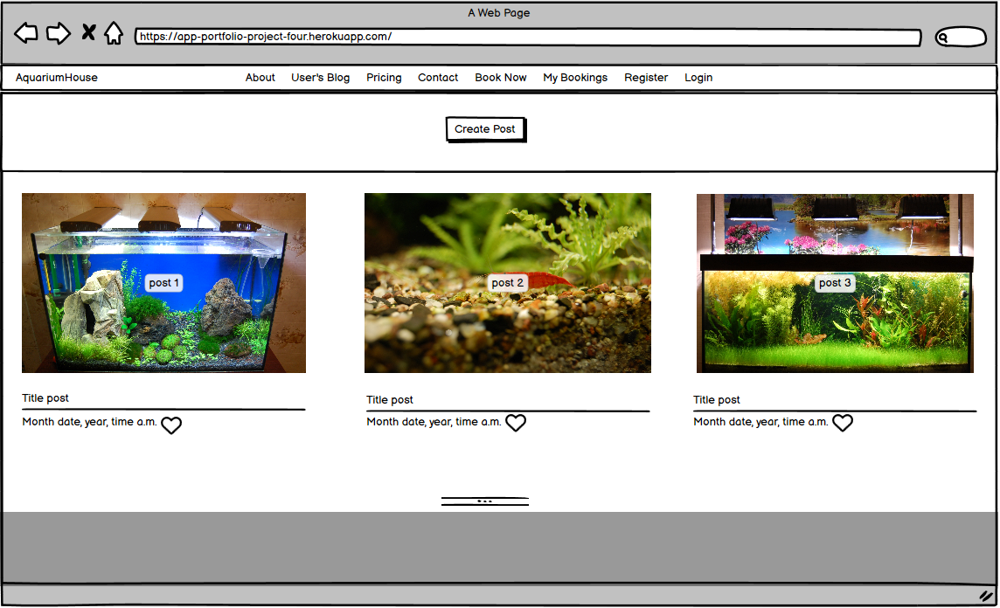

## Table of contents
- [**UX (User Experience)**](#ux-user-experience)
  - [**User Stories**](#user-stories)
- [**Design Structure**](#design-structure)
  - [**Functional Structure**](#functional-structure)
  - [**Wireframes**](#wireframes)
- [**Features**](#features)
  - [**Responsive Design**](#responsive-design)
- [**Technologies**](#technologies)
  - [**Languages**](#languages)
  - [**Frameworks**](#frameworks)
  - [**Tools**](#tools)
- [**Testing**](#testing)
- [**Deployment**](#deployment)
- [**Credits**](#credits)
  - [**Code**](#code)
  - [**Content**](#content)
  - [**Media**](#media)
  - [**Inspiration**](#inspiration)
  - [**Acknowledgments**](#acknowledgments)

 
# Portfolio Project 4 - Aquarium House

The deployed [Aquarium House](https://app-portfolio-project-four.herokuapp.com/) app.

The [GitHub repository](https://sergiykoche-portfoliopr-sugfh0sfbwm.ws-eu90.gitpod.io/)

## Project goals
This is the fourth project under the Code Institute Diploma in Software Development (E-commerce Applications) program. This website is a fictional aquariumistics called Aquarium House. It is designed to be responsive and accessible on a variety of devices for the ease of use of the site by potential users.

## UX (User Experience)

### User stories

#### First time visitor goals

As a first time visitor, I want:
* to easily understand the main purpose of the site.
* to be able to easily navigate throughout the site.
* to be able to register a user account to access all content without restrictions.
* to be able to log out of my user account.
       
        
#### Returning and frequent user goals

As a returning user, I want:
* to sign in to my user account.
* to make a service booking.
* to view my booking details. 
* to edit my booking details or delete them.
* to create users post, edit and delete them.
* to sign out of my account to keep my account safe.
* to be able to reserve a day and time for a service, view booking details and make changes to created bookings and delete my bookings.

#### Site Administrator goals
As a Site Administrator I would like to be able to create, view, edit and delete booking data and create, edite, delete posts.

### Agile tools

The GitHub Projects section was used as a [Kanban board](https://github.com/users/SergiyKochenko/projects/6) for the development of this project, which made it possible to break down the project execution into subtasks and make it easier to complete and track project progress.
[User stories](https://github.com/SergiyKochenko/portfolio-project-four/issues) were used to break down the project into sub-tasks and placed on the Kanban board to work on them and track progress.

[Back to the top](#table-of-contents)

## Design Structure

The site was based on the Blog template from the CodeInstitute site. The look of the site, color scheme, font, logo and image for the home page were made by myself from the template.
The main page layout can be seen below:

Aquerium House website design templates

About page 

Home page 

Pricing page 

Contact page 

Book Now page 

My Bookings page 

Create Post 

Edit Post 

Delete Post 

Logout page 

Login page 

Register page 

 

### Functional Structure

**Home page (User's Blog):** The home page contains a posts, logo and an image that gives the user an idea of ​​the type of service provided. Under the nav menu in the center is the button to create post, a new user or login for an existing user, only existing users can create a post. Not registered user will redirect to registration page.
Registration and login are also available from the navigation bar.

**Create post page:** The create post page is only available to authenticated users.
The user is asked to fill out a form with the required fields - title, content, image, and an optional field - excerpt.
After filling out the form, the user is to submit button and than user will be redirected to the page of current user's blog.

**Edit post page:** This page is available only to authenticated users and has the same functionality and form as the create post page, where users can update post details.

**Delete post page:** This page is only available to authenticated users and has the same functionality and form as the create, update post page, where the user can update the post details. The user has the ability to delete user's post by selecting the Delete button on the post page. After that, user will be redirected to the delete page where user needs to confirm user's intention. After successfully deleting the post, user will return to the user's blog page and receives a message at the top of the screen.
Also, if the user changes user's mind, user can return to the page by clicking on the go Back button.

**Pricing page**

The Pricing page provides information about all available Aquarium House services. User also can book necessary service straight from the Pricing page by clicking on the services price and the user will be redirected to creat booking form.

**Registration page:** The user must create an account to make a reservation, or create post.
To do this, user is asked to fill out a form on the page with the required fields: username and password. There is also an optional email field.

**Login page:** A username and password are required to log in existing users.
The user can use the navigation menu login button.
After a successful login, the user receives a message at the top of the screen and is redirected to the main page.

**Logout page:** Logging out of the account is done through the navbar menu, after which the user is redirected to the logout page where user must confirm his desire to log out of the account. After a successful logout, the user is returned to the main page and receives a message at the top of the screen.

**Booknow page:** The Booknow page is only available to authenticated users.
The user is asked to fill out a form with the required fields - name, service, time and date, and an optional field - phone, email.
After filling out the form, the user is redirected to the page of current bookings.

**My Bookings page:** Only authenticated users have access to the Booking page. The link to this page becomes accessible in the navigation menu once a user is authenticated. Booking page shows to user information about made bookings and contains Change button and Delete button for manage booking.

**Change booking page:** This page is available only to authenticated users and has the same functionality and form as the Booknow page, where users can change  booking details.

**Delete booking page:** This page is only available to authenticated users and has the same functionality and form as the Booknow page, where the user can change the booking details. The user has the ability to delete user's booking by selecting the Delete button on the Booking page. After that, user will be redirected to the delete page where user needs to confirm user's intention. After successfully deleting the booking, user will return to the Booking page and receives a message at the top of the screen.
Also, if the user changes user's mind, user can return to the page by clicking on the Back to my Bookings button.

**Contact page** The contact page contains a contact information, Google map, phone number and support email, photo shooting service and "Book Now" button. 
The Book Now button is accessible for new user or login for an existing user, only existing users can book. Not registered user will redirect to message page with the message: "To make a reservation, please login, if youhave not created an account yet, then please sign up.
Registration and login are also available from the navigation bar.

**About page** The page is open for all users, and contains the description of the company.

**Footer** The footer contains logo, navbar, contact information, social media icons, copyright.

[Back to the top](#table-of-contents)

### Wireframes

The wireframes were slightly modified during the actual creation of the project, e.g. with pages installed removed form for user convenience and better UX.
The wireframes can be seen below:

**For Mobile view and small screens**

Home page

Sign up page

Login page

Pricing page

Contact page

Book Now page

My Bookings page

About page

 

**For Desktop view**

Home page

Sign up page

Login page

Pricing page

Contact page

Book Now page

My Bookings page

About page

 

[Back to the top](#table-of-contents)

## Features

### Navbar

The navigation bar is present on all pages of the site. The navigation bar changes depending on whether the user is a guest or an authorized visitor.
Also, the navigation bar is an adaptive element, and on mobile screens it collapses into a hamburger icon.

Navigation bar for an unauthorized user:

Navigation bar for an authorized user, menu items My Bookings and Logout are available:

### Home page

On the Home page a user can create an account or Login from the menu:

### Sign up page

To create an account user should fill in form provided on Sign up page:

### Login page

To login the user should enter credential data that was used during sign up process:

### Pricing page

The Pricing page provides information about all available Aquarium House services. User also can book necessary service straight from the Pricing page by clicking on the services price:

### Book Now page for the logged user

Users must be logged in to make a booking. To book a service, the user must fill in the required fields in the form: name, services, date, time and an optional email,  phone fields:

If the user is not authenticated then the user will be shown a message that the user has to sign up or login:

### My Bookings page

The Booking page is available only to authorized users. The booking page displays the following data: order ID, date, time, service name and cost of the booked service:

If the user has not yet booked any services, then the user will be shown a message that the user has no bookings at the moment and there is an opportunity  to make a booking:

### Change booking page

Each booking can be changed or deleted. The user must be authenticated in order to access the change user's bookings.
The change booking page can be accessed for a specific booking. The page Change booking contains an auto-filled booking form. The user can change the fields at his discretion, or go back to bookings page by clicking the button "Back to my bookings":

### Delete page

The User must be authenticated to delete the booking. The Delete booking page provides two buttons: 'Yes, delete booking' and 'Back to my bookings' if the user changes his mind. 
Deletion will delete the only specific booking for the user:

### Logout page

An authenticated user can logout from account by clicking the Logout button, after which the user will be redirected to the Logout page where the user needs to confirm to logout from account to prevent occasionally log out of user account:

### Responsive design
The site has been designed to be responsive and adapted for desktop and mobile use.
The project has been tested using a multi-device emulator with different screen sizes in the Google Chrome Developer Dashboard.

[Back to the top](#table-of-contents)

## Technologies

### Languages
  - Python
  - JavaScript
  - HTML5
  - CSS3

### Frameworks

  - [Django](https://www.djangoproject.com/): python framework used to create all the backend 

### Database:
  - [PostgreSQL](https://www.postgresql.org/): the database used to store all the data.

### Tools

- [Google Fonts:](https://fonts.google.com/) Was used to to incorporate font styles.  
- [Font Awesome](https://fontawesome.com/): was used to create the icons used on the website.
- [Bootstrap](https://getbootstrap.com/) Was used to create the front-end design.
- [Gitpod:](https://Gitpod.io/) Gitpod was used as IDE to commit and push the project to GitHub.
- [GitHub:](https://github.com/) Was used as a version control system to manage the code
- [Figma:](https://www.figma.com/) Was used to create wireframes
- [TinyPNG:](https://www.figma.com/) Was used to reduce the size and weight of images and optimizing interaction with the site 
- [Am I Responsive](http://ami.responsivedesign.is/) to generate an image showcasing the website's responsiveness to different screen sizes 
- [Pip3](https://pypi.org/project/pip/): is the package manager to install Python modules and libraries.
- [Gunicorn](https://docs.djangoproject.com/en/4.1/howto/deployment/wsgi/gunicorn/): "Green Unicorn" is a Python Web Server Gateway to translate HTTP Requests for Python to understand.
- [Spycopg2](https://pypi.org/project/psycopg2/): PostgreSQL database adapter so I can manage the Database in Python. 
- [Cloudinary](https://cloudinary.com/): the image hosting service used to upload images and other media.
- [Heroku](https://dashboard.heroku.com/): the hosting service used to host the website.
- [VSCode](https://code.visualstudio.com/): the IDE used to develop the website.
- [Chrome Developer Tools](https://developer.chrome.com/docs/devtools/open/): was used to debug the website.
- [W3C Validator](https://validator.w3.org/): was used to validate HTML5 code for the website.
- [W3C CSS validator](https://jigsaw.w3.org/css-validator/): was used to validate CSS code for the website.
- [Github Projects and Kanban board](https://github.com/users/SergiyKochenko/projects/6) was used to track the progress of the project in general and of every application in the project.
- [Free grammar checker](https://www.zoho.com/writer/free-grammar-checker.html)

[Back to the top](#table-of-contents)

MADE FORMATING HTML WITH: https://www.freeformatter.com/html-formatter.html#before-output

MADE FORMATING CSS WITH: https://www.cleancss.com/css-beautify/

MADE FORMATING PYTHON WITH: https://black.vercel.app/

## Testing

### Bugs

#### Fixed Bugs

|  Bug  | Attached images  |  Solution  |Status   |
|--|--|--|--|
|  
Menu on mobile devices is positioned incorrectly | - | fixed CSS style   | fixed |
|Pricing form does not appear on the Pricing page  | - | fixed by passing form object to the pricing.html template , placing form tags in in the proper template pricing.html | fixed |
| In the Gitpod Environment the site works with full CSS style,  but on Heroku the site  and the admin page (/admin) comes up without CSS styling  | - | Set DEBUG variable to False and remove the DISABLE_COLLECTSTATIC variable | fixed |
| Function get_min_date isn't defined  | see attached img 3 | fixed by removing function from views.py file and placing function in the forms.py so the form can access that function | fixed  |
| When an invalid phone number is entered on the Booknow page, the form clears the fields and returns to its original state with no messages to the user. The Change Booking page also returns the form to its original state with pre-filled fields | - | Added regex validation for numeric input and displaying a message to the user | fixed  |
| Pricing elements on the Pricing page are not displayed correctly on mobile devices | see attached img 4 | added media queries rules for small screen devices  | fixed  |

 

#### Unresolved Bugs
One bug known unresolved remaining
See bug report: [bug report one](https://github.com/users/SergiyKochenko/projects/6)

Create post page with the same title

[Back to the top](#table-of-contents)

---
### Manual Testing

#### Device Testing

The Project was tested using a multi-device emulator with different display sizes in the Google Chrome Developer Dashboard.
The following devices have been tested:

- Nest HubMax (Desktop)
- iPad Pro (Tablet)
- iPad Air (Tablet)
- iPad Mini (Tablet)
- Galaxy Tab S4 (Tablet)
- Nexus 7 (Mobile)
- Nokia N9 (Mobile)
- iPhone 12 Pro Max (Mobile)
- iPhone 5/SE (Mobile)
- iPhone 4 (Mobile)

#### Browsers Tested

Testing has been carried out on the  following browsers: 
  - Google Chrome
  - Firefox
  - Microsoft Edge

The site was constantly tested during the process of creating the site in the Gitpod Environment and the deployed site on Heroku was also tested in terms of user experience.
The available functionality and user experience is reflected in the table below.

| Goals/actions  | As a guest | As a logged user  | Result | Comment |
|--|:--:|:--:|:--:|--|
| User can use menu and navigating through pages | &check; | &check; | Pass | Click on menu item redirects to appropriate page |
| User can see the home page | &check; | &check; | Pass | |
| User can see the Pricing page | &check; |&check;  |  Pass| |
| User can see the Sign Up page | &check; |&check;  |  Pass| |
| User can see the Login page  | &check; |&check;  |  Pass| |
| User can see the Logout page  | &check; |&check;  |  Pass| |
| User can click the Book Now button  | &check; |&check;  |  Pass| Redirects to the page with a message that the user must register or log in for guest or shows up form for authorized user |
| User can see the Booknow page | &cross; | &check;  | Pass |A page is displayed with a message that the user must register or log in  |
| User can fill fields in the form the Booknow page | &cross; | &check;  | Pass |This page and form are available only to authorized users |
| User can see the Bookings page   | &cross; | &check;  | Pass | This page is available only to an authorized users|
| User can see the Change booking page  | &cross;  | &check;  | Pass | This page is available only to authorized users|
| User can edit booking in the form on the Change booking page  | &cross;  | &check;  | Pass |This page is available only to authorized users ||
| User can see the Delete booking page  |  &cross; | &check;  |Pass  | This page is available only to authorized users |
| User can see the  User's blog page  |  &check; | &check;  |Pass  |  |
| User can see the Create post  |  &cross; | &check;  |Pass  | This page is available only to authorized users |
| User can see the Delete post  |  &cross; | &check;  |Pass  | This page is available only to authorized users |
| User can see the  Update post  |  &cross; | &check;  |Pass  | This page is available only to authorized users |
| User can see the  attach image  |  &cross; | &check;  |Pass  | This page is available only to authorized users |
| User can like post and unlike  |  &cross; | &check;  |Pass  | This page is available only to authorized users |
| |

 

[Back to the top](#table-of-contents)

## Validation

### HTML Validation:

The [W3C Markup Validation Service](https://validator.w3.org/) was used to validate the HTML of the website. 
There were errors and warnings in the reports about unclosed elements and tags, incorrect values ​​and types of elements, unnecessary trailing slashes. All errors and warnings have been fixed, the project's HTML code has been re-checked without errors.

base.html

about.html

bookings.html

booknow.html

change-booking.html

contact.html

create-post.html

delete_post.html

delete-booking.html

edit_post.html

post_detail.html

pricing.html

usersblog.html

login.html

logout.html

signup.html

---
### CSS Validation:

The website CSS style has successfully passed the [W3C Jigsaw CSS Validation Service](https://jigsaw.w3.org/css-validator/). 

---
 

### Python Validation (PEP8)

All Python code was manually checked using [CI Python Linter](https://pep8ci.herokuapp.com/). 
The Linter reports had messages about exceeding the string length of 79 characters. Testing did not reveal any errors.

urls.py

models.py

forms.py

views.py

[Back to the top](#table-of-contents)

---

##  Deployment

The project was developed using Gitpod, the project code is stored on GitHub, and then deployed to Heroku.
To deploy, follow these steps:

1. Log in to Heroku or create an account if required.
On the Welcome page in the top right corner click the button labeled 'New'.

2. From the drop-down menu select 'Create new app'.
Enter a preferred app name.
Select the relevant geographical region.
Click to 'Create App'.

3. Navigate to 'Settings' and scroll down to the 'Config Vars' section.
Click 'Reveal Config Vars' and enter 'PORT' for the key and '8000' for the value. Then click 'Add'.
Add CLOUDINARY_URL, DATABASE_URL and SECRET_KEY. URL variable values ​​must be copied from your [CLOUDINARY](https://cloudinary.com/) account  and [ElephantSQL](https://www.elephantsql.com/) account.
To create a SECRET KEY, use the online service or come up with your own.

4. Click on the 'Deploy' tab.
Next to 'Deployment method' select 'GitHub'.
Connect the relevant GitHub repository.
Under 'Manual deploy' choose the correct branch and click 'Deploy Branch'.
Also you can select 'Automatic Deploys' so that the site updates when updates are pushed to GitHub.

5. After successful deployment message in the page top right corner click the button labeled 'Open app' and you can access live app.

### Forking the GitHub Repository

To use this code and make changes without affecting the original code, it is possible to 'fork' the code on the GitHub repository through the following steps:

1. Create  or log into your GitHub account.
2. Go to the GitHub [repository](https://github.com/SergiyKochenko/portfolio-project-four).
3. Click the 'Fork' button in the upper right-hand corner of the page.
A copy of the repository will be available in your own repository.

### Making a Local Clone
1. Log in to GitHub and locate the GitHub Repository
2. Under the repository name choose button "Code",  click "Clone or download".
3. To clone the repository using HTTPS, under "Clone with HTTPS", copy the link.
4. Open your development editor of choice and open a terminal window in a directory of your choice
5. Type *git clone*, and then paste the URL you copied in Step 3.

``> git clone https://github.com/YOUR-USERNAME/YOUR-REPOSITORY``

Press Enter. 

Your local clone will be created.

For more information follow this [link](https://docs.github.com/en/repositories/creating-and-managing-repositories/cloning-a-repository#cloning-a-repository-to-github-desktop).

[Back to the top](#table-of-contents)

## Credits

### Code

The structure and the code of the project was based on two walkthroughs by the Code Institute:
  * Hello Django - I created CRUD functionalities based on the examples of this walkthrough.
  * From I think  therefore I blog -  I borrowed confirmation messages code and also followed the site deployment steps outlined here. 

Date picker field and minimum date validator taken from [here](https://gist.github.com/stasyao/99376eb0cf0ad3599f9737c421b5210e#part_4).

[Official Django Documentation](https://docs.djangoproject.com/en/4.1/ref/) was researched for code expressions  and code functionalities.
Django [choices fields](https://docs.djangoproject.com/en/4.1/ref/models/fields/).

Stack Overflow was used intensively for research into code functionalities and problem solving. 

### Content

The site home page is taken from the Aquarium community template. I slightly changed the look of the home page and tried to keep the rest of the pages in the same style.

### Media

Images were all open source and free to use from my owen collections, as I am aquarist my self.

### Inspiration

This project was inspired by the Hello Django project and the I Think Therefore I Blog project.
Website template from Aquarium community. 

### Acknowledgments

Kerry Colledge for supporting all our group and for  individual support in all circumstances.
The tutor support team at Code Institute for their support.
To my friends who participated in testing my application.

[Back to the top](#table-of-contents)